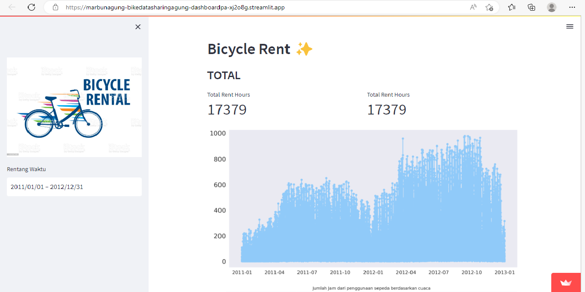

# Bicycle Rent Dashboard ✨

## Setup Environment

- conda create --name main-ds python=3.9
- conda activate main-ds
- pip install numpy pandas scipy matplotlib seaborn jupyter streamlit babel

## Run Streamlit App

#### Tolong jalankan pada anaconda.prompt
#### streamlit run dashboardPA.py

## Link Untuk Dashboard saya yang telah saya deploy : https://marbunagung-bikedatasharingagung-dashboardpa-xj2o8g.streamlit.app/

